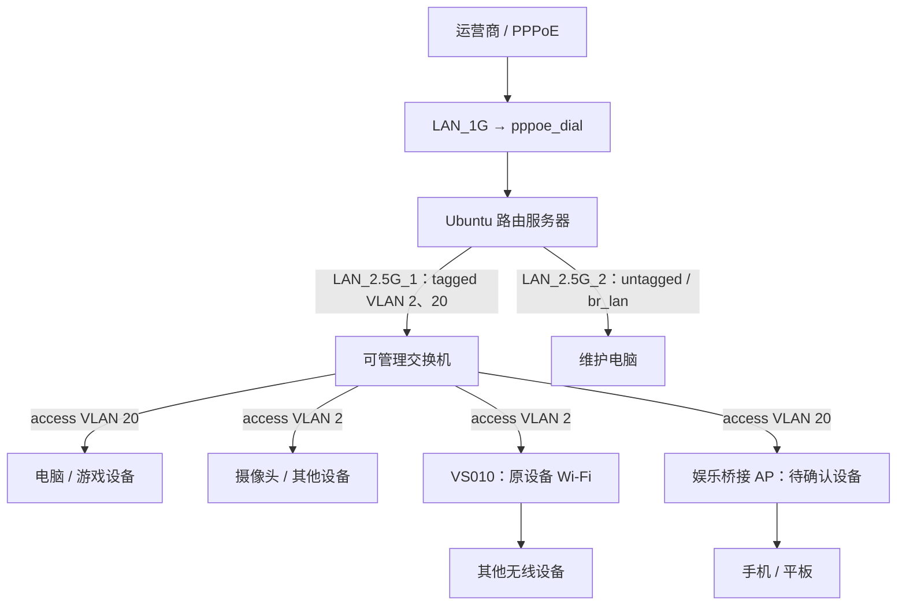

# VLAN 与混合 IPv6 设计及迁移计划

调查及整理日期：2026-09-28，Asia/Shanghai。状态：设计与实施计划，尚未部署。

目标：手机、电脑等娱乐设备属于同一个 VLAN，自动取得运营商公网 IPv6；其他设备属于另一个 VLAN，继续使用当前 ULA + NAT66。两组 IPv4 都经现有 PPPoE NAT 上网。用户已确认两组 IPv4/IPv6 双向互通，仅区分 IPv6 出网方式，不实施组间访问隔离。

已完成服务器只读调查、一次 DHCPv6 SOLICIT/ADVERTISE 询问和候选配置离线检查。没有修改 /etc 配置、没有重拨、没有启动 PD 客户端、没有确认 PD 租约。此目录的候选配置不应直接整目录复制到生产配置目录。

## 0. 当前决策与执行入口

本文件是后续实施的主计划，合并服务器调查、地址规划、VS010 登录核查、迁移和回滚要求。上述“没有修改”仅指本次 VLAN 方案；此前 IPv6 地址冲突规避和 IPv4 DHCP 池调整已经生效，应继续保留。

**当前按双 AP 拓扑准备实施：VS010 保留其他设备 Wi-Fi，接交换机 access VLAN 2；另一个桥接 AP 承载手机等娱乐设备，接 access VLAN 20。** 第二台 AP 是否已有、如何接线尚待确认；这是一条待落实的实施路径，不代表现场已具备全部设备。先用有线电脑试点 VLAN 20，可以独立验证服务器侧方案。

单 AP 双 SSID 作为条件方案保留：只有确认 VS010 当前固件支持每 SSID VLAN 绑定，并验证标签转发后才采用。2026-09-28 已成功登录 VS010，但设置页面截断、隐藏入口报错、SSH/Telnet 未开放，因此该能力仍为未知，不按“不支持”定性，也不作为实施前提。

| 状态 | 事项 | 下一步 |
|---|---|---|
| 已确定 | VLAN 2 保留其他设备；VLAN 20 放手机/电脑 | 按第 1、4 节落实端口与地址 |
| 已确定 | 两网 IPv4/IPv6 双向互通，仅区分 IPv6 出网方式 | 按第 6 节配置三层转发；发现协议按第 7 节验收 |
| 已验证部分条件 | 运营商返回 /62 PD 提议 | 正式部署确认租约、回程、续租及重拨恢复 |
| 待补齐 | 交换机型号、实际端口与上联接线 | 填写下方端口表后准备设备配置 |
| 待补齐 | 第二台桥接 AP 的可用性及娱乐 SSID | 确认后实施无线迁移；此前可做有线试点 |
| 待实现 | PD 服务及 PPP hooks、路由防火墙脚本、定时回滚 | 依据候选配置和第 5、6、10 节生成并审核 |
| 待核对 | 必须保留的公网入站服务 | 列出协议、端口和目标，纳入防火墙例外与外网验收 |
| 未执行 | VLAN 切换、终端迁移、生产验证 | 按第 8 节逐阶段实施，不直接覆盖运行配置 |

实施前填写端口表；“待填写”不是可直接使用的交换机端口号：

| 实际交换机端口 | 连接对象 | 最终端口配置 |
|---|---|---|
| 待填写 | 服务器 LAN_2.5G_1 | tagged VLAN 2、20 |
| 待填写 | VS010 上联 | access VLAN 2，PVID 2 |
| 待填写 | 娱乐 AP 上联（设备待确认） | access VLAN 20，PVID 20 |
| 待填写 | 娱乐电脑 | access VLAN 20，PVID 20 |
| 待填写 | 摄像头、其他设备或其下级交换机 | access VLAN 2，PVID 2 |

相关文件：

- [VS010 后台核查记录](VS010后台核查-20260928.md)：登录结果、页面异常与能力判断依据。
- [Netplan 候选](netplan.candidate.yaml)、[dnsmasq 候选](dnsmasq.candidate.conf)、[PD 客户端候选](dhcp6c-pd.candidate.conf)：供实施前审核，尚未应用。
- [离线验证记录](validation.txt)、[PD 提议记录](pd-observation.json)：此前检查证据，不等同于生产部署验收。

## 1. 建议方案

保留 VLAN 2 的旧地址和服务入口，把娱乐设备迁到 VLAN 20。服务器现有 LAN_2.5G_1 改为承载 VLAN 2/20 的 tagged trunk；LAN_2.5G_2 保留为 VLAN 2 的普通无标签维护口。

| 用途 | VLAN | 三层接口 | IPv4 | IPv6 |
|---|---:|---|---|---|
| 其他设备、现有设备管理 | 2 | br_lan | 192.168.2.0/24，网关 .1 | fc00:192:168:2::/64，经 NAT66 |
| 手机、电脑、游戏设备 | 20 | br_ent | 192.168.20.0/24，网关 .1 | PD 中分配的一个公网 /64，原生路由 |
| Docker | 不变 | 现有 Docker 网桥 | 172.17/16、172.18/16、172.19/16 | 当前未启用容器 IPv6 |
| ZeroTier 管理 | 不变 | ztc25d6dqt | 192.168.192.0/24 | 不参与公网前缀发布 |

VLAN 编号不要求与 IP 子网一致；这里选择 2 和 20 是为方便记忆。设备属于哪个 VLAN，由交换机端口或 AP 的 SSID 决定，不能通过给同一普通 LAN 手工填写两个不同 IPv4 网段来替代。



同一个物理网口可以传两个 VLAN，但 vlan2 和 vlan20 不得放进同一个普通网桥。主方案使用两个独立网桥和 VLAN 子接口，不要求把现有普通网桥改成 VLAN-aware bridge。

## 2. 当前服务器的实际情况

| 项目 | 已确认事实 | 对设计的影响 |
|---|---|---|
| 操作系统 | Ubuntu 24.04；systemd 255；netplan.io 1.1.2 | 延续 Netplan + networkd，不更换路由系统 |
| LAN 接入 | LAN_2.5G_1 有载波；LAN_2.5G_2 无载波；都属于 br_lan | 第二口可保留为独立接线的维护入口 |
| 网桥 | br_lan，STP 开启，vlan_filtering=0 | 目前 LAN 没有按 VLAN 隔离 |
| 内网地址 | 192.168.2.1/24、fc00:192:168:2::100/64 | 原设备与服务器服务地址可以保留 |
| DHCP | dnsmasq 2.90，监听 br_lan；IPv4 .101～.254；ULA DHCPv6 + SLAAC | 需增加 br_ent，并把网关/DNS 选项按网段区分 |
| 保留地址 | 192.168.2.100 未动态分配，但当前没有配置成服务器接口地址 | 不把 .100 误写成现有服务入口 |
| WAN 接入 | pppd 的实际 plugin 为 pppoe.so LAN_1G | 不把 PPPoE 迁到 vlan_ppp |
| WAN VLAN | Netplan 创建了 VLAN 36 的 vlan_ppp，但当前 PPPoE peer 使用 LAN_1G | LAN VLAN 2/20 与这个 WAN 配置分开处理 |
| PPPoE MTU | 运行值与 /etc peer 均为 1440；参考文件仍写 1492 | 本次保留 1440，记录副本存在这一差异 |
| WAN IPv4 | 100.127.28.205，运营商 CGNAT 范围 | VLAN 不会使 IPv4 变成公网地址 |
| WAN IPv6 | 2408:823c:5006:1910::/64 内的地址；有临时地址 | 这是 WAN 链路前缀，不是 LAN PD 前缀 |
| 转发 | IPv4/IPv6 forwarding 已开启；br_lan accept_ra=0；pppoe_dial accept_ra=2 | WAN 接收 RA，LAN 由 dnsmasq 发送 RA |
| 路由 | 一个 PPPoE 出口；没有按设备的策略路由 | 本需求不需要增加第二拨号或策略路由表 |
| PD 客户端 | wide-dhcpv6-client 已安装但 masked；原配置 information-only | 原配置不会申请前缀，不能仅解除 mask 即使用 |
| PPP IPv6 hooks | ipv6-up.d / ipv6-down.d 当前为空 | 可添加专用 PD 生命周期联动 |
| IPv6 NAT | -o pppoe_dial 的无源地址限制 MASQUERADE | 必须收窄，否则公网客户端仍被 NAT |
| 防火墙 | IPv4/IPv6 INPUT、FORWARD 默认 ACCEPT | 公网 IPv6 下发前要完成入站与跨 VLAN 策略 |
| 持久化 | netfilter-persistent 启用；rules.v4/v6 保存有 Docker 规则 | 不能把旧整表当作新方案模板直接恢复 |
| ShellCrash | ipv6_redir=OFF；运行规则为本机 OUTPUT；IPv6 TCP 显式 return | 当前未观察到转发 IPv6 被透明代理截获 |
| 服务 | HA、ESPHome、MQTT、Frigate、Jellyfin 等运行中 | 跨网段服务访问、回调和发现需单独验收 |
| 管理拓扑 | 用户确认交换机支持 VLAN；AP 为桥接模式联通 VS010；LLDP 无邻居 | VS010 当前固件是否支持每 SSID 绑定 VLAN 尚未证实 |

当前 Netplan、dnsmasq、99-forward.conf 与 routerconfig 的对应记录内容相同；PPPoE MTU 存在上述差异。静态记录能证明配置意图，运行时地址、规则与服务状态用于证明实际行为。

DHCP 租约文件有 55 条 IPv4、6 条 IPv6 记录，包含手机、电脑和智能设备，但其中有历史记录，不能当作 61 台在线设备。设备迁移名单应按实际端口、SSID 与设备用途核对。

另有三项已有问题应在部署时处理或保留观察记录：

- 参考 firewall-set.sh 中有 `ACCREPT` 拼写错误，且反复执行会重复追加规则，不能直接用它做新方案部署程序。
- 现有 DHCP 宣告服务器提供 NTP，但未发现 UDP/123 监听；候选配置不再宣告这个未验证的服务。
- dnsmasq 日志有 resolvconf 调用 systemd-resolved 接口失败的信息；当前 dnsmasq 仍运行，迁移不能顺带假定 resolved 已启用。现有上游 resolv.conf 中还包含 127.0.0.1，后续核对日志后再决定是否清理。

## 3. 公网 IPv6：已经取得的现场证据

在 pppoe_dial 上发送标准 DHCPv6 SOLICIT，携带 IA_PD，不带 Rapid Commit。仅接受同事务号与 Client ID 的回应；没有发送 REQUEST。

| 回应字段 | 现场值 |
|---|---|
| 消息 | ADVERTISE，type 2 |
| 上游来源 | fe80::ce1a:faff:feee:b660 |
| 提议前缀 | 2408:823d:5016:8804::/62 |
| 状态 | SUCCESS |
| T1 / T2 | 1800 / 2880 秒 |
| preferred / valid lifetime | 3600 / 7200 秒 |

因此当前链路确实有上游愿意提供 PD，/62 可分为四个 /64。若最终租约相同，子网依次为 `...:8804::/64`、`...:8805::/64`、`...:8806::/64`、`...:8807::/64`。只给 VLAN 20 用第一个，余下保留，不给 VLAN 2 发布公网前缀。

这不是已经确认的租约，也没有验证该前缀的实际回程路由。正式客户端使用的持久 DUID 可能与探测身份不同，因此最终前缀可能不同。不能将现场值硬编码到 Netplan、DHCP 或长期防火墙规则。DHCPv6 的 ADVERTISE 与 REQUEST/REPLY 阶段区别见 [RFC 9915](https://www.rfc-editor.org/rfc/rfc9915.html)。

当前服务器自身 IPv6 到 2400:3200::1 的两次 ping 成功、无丢包。这只证明 WAN IPv6 可用，不等价于已验证娱乐客户端原生 IPv6。

## 4. 交换机与 AP 端口规划

| 连接对象 | 交换机端口设置 | 备注 |
|---|---|---|
| 服务器 LAN_2.5G_1 | VLAN 2、20 均 tagged | 服务器原始物理口无三层地址，也不直接桥入 br_lan |
| 电脑/游戏机 | access VLAN 20，untagged，PVID 20 | 终端无需配置 VLAN 标签 |
| 摄像头/普通智能设备 | access VLAN 2，untagged，PVID 2 | 保留旧 IPv4、ULA 地址 |
| 下级普通交换机 | 上联 access VLAN 2 或 20 | 该普通交换机后面所有设备归同组 |
| VS010（双 AP 路径） | access VLAN 2，untagged，PVID 2 | 保留原有其他设备 Wi-Fi |
| 娱乐 AP（双 AP 路径） | access VLAN 20，untagged，PVID 20 | 使用独立娱乐 SSID；设备可用性待确认 |
| VLAN AP | tagged 20；VLAN 2 按 AP 管理 VLAN 能力设 tagged 或 native | AP 上的两个 SSID 分别映射到 2、20 |
| 维护电脑 | 直接插服务器 LAN_2.5G_2 | 普通无标签接入 br_lan；不要同时再接回同一交换机形成环路 |

交换机到服务器一侧建议 tagged-only；如设备必须设置 native VLAN/PVID，设为不用的 VLAN 并限制入口，不把 untagged 帧意外归入娱乐 VLAN。AP 管理地址暂保留旧网段；AP 上联若要求 native VLAN 2，允许在 AP 端口上使用 hybrid，与服务器端口的 tagged 2 并不矛盾。

AP 应使用桥接/AP 模式，由服务器提供 DHCP、RA 和路由。不能再启用 AP 自己的 DHCP、IPv6 路由或把两个 SSID 桥接回同一 LAN。

交换机内部管理 IP 可暂保留 192.168.2.10，AP 管理 IP 可暂保留 192.168.2.30，前提是核实当前静态记录对应设备。由于它们与 IoT 同 VLAN，本方案不提供同 VLAN 内的设备管理隔离；若以后有此要求，再增加管理 VLAN。

### VS010 的实施条件与替代方案

用户已确认 VS010 工作在桥接模式。服务器 ARP 观察到 192.168.2.30 对应既有 MAC 58:95:d8:1a:83:1a。初次未认证调查访问 /api 返回 HTTP 403；2026-09-28 15:52–15:54 使用用户提供的管理密码登录成功，取得认证 Cookie 和 stok，已直接访问设备核查。

本次认证后的首页、无线设置 `/admin/wifi` 和高级设置 `/admin/advance` 均仅返回顶部菜单，HTML 在退出链接附近截断，未返回设置表单。无线与高级页面的 HTTP 状态虽为 200，但 curl 最终报告传输未完成（退出码 18）；不能把 HTTP 200 当作后台功能正常。静态 `common.js` 可完整读取，但没有发现能证明每 SSID VLAN 绑定能力的内容。页面静态资源版本标记为 `Dec11093955CST2024`，这不是已核实的完整固件版本号。SSH 22/Telnet 23 均拒绝连接。

因此 SSID VLAN 支持情况仍为**未能确认**，不能据页面异常推断“不支持”。本次仅登录和读取页面，没有修改 AP、服务器网络或应用候选配置。部署时仍不能把单台 VS010 承载两个无线 VLAN 当作已满足条件；需要能正常读取的 SSID/VLAN 配置或系统配置证据。详细实测见同目录 `VS010后台核查-20260928.md`。

桥接模式仅表示不由 AP 执行路由/NAT，不保证能把不同无线客户端分入不同 VLAN。需要在当前固件管理页面核实：是否存在每个 SSID 的 VLAN ID、LAN VLAN/bridge 绑定、上联 tagged/native VLAN 和无线客户端隔离设置。只有 WAN/IPTV VLAN 选项不足以证明具备这项能力。

- **若支持每 SSID 绑定 VLAN**：VS010 一台 AP 承载两个 SSID，分别入 VLAN2/20；关闭会阻止局域网互访的访客隔离/AP 客户端隔离。管理地址保持旧网段，实际 tagged/native 管理方式按固件设置。
- **若不支持**：最省维护的替代方案是 VS010 继续服务原 IoT Wi-Fi，接交换机 access VLAN2；另一个可用 AP 服务手机，接 access VLAN20。两个 AP 都可使用普通桥接模式，不要求 AP 自己识别标签。
- **若所有无线设备都属于同一组**：VS010 可直接接对应 access VLAN，无需多 SSID VLAN。但当前目标包含混合无线设备时，不能把整台 AP 简单划到 VLAN20 后认为 IoT 仍留在 VLAN2。
- 本计划不包含刷第三方固件，也不以交换机按 MAC 分类作为单 AP 的默认替代：还要解决同一无线桥上的 RA/广播分发，无法仅靠服务器 DHCP 保留地址达到可靠分组。

## 5. 服务器配置设计与候选文件

### 5.1 Netplan

`netplan.candidate.yaml` 是完整替换候选，不是可以与原文件叠加的增量文件。

- 保留 LAN_1G、vlan_ppp、PPPoE 的现有结构与参数。
- 在 LAN_2.5G_1 上建立 vlan2、vlan20。
- br_lan 的成员改为 vlan2 与 LAN_2.5G_2；保留 192.168.2.1、fc00:192:168:2::100 及当前网桥 MAC。
- br_ent 的成员只有 vlan20，IPv4 为 192.168.20.1；公网 IPv6 由 PD 客户端动态配置。
- 两个 LAN 网桥禁收 RA；原始 trunk 和 VLAN 子接口不运行 DHCP 客户端。
- 不写静态公网 IPv6，不在两个桥上复用一个 /64。

此方案利用 Netplan 原生 VLAN/bridge 定义，见 [Netplan YAML 文档](https://netplan.readthedocs.io/en/stable/netplan-yaml/)。

### 5.2 DHCP、DNS、RA

`dnsmasq.candidate.conf` 同样为替换候选，不能和旧 dhcp.conf 同时加载。

| 项目 | VLAN 2 | VLAN 20 |
|---|---|---|
| IPv4 动态池 | .2.101～.2.254 | .20.101～.20.254 |
| 网关 / IPv4 DNS | 192.168.2.1 | 192.168.20.1 |
| 动态 IPv4 租期 | 建议 24h | 建议 24h |
| IPv6 | 保留 ULA DHCPv6 + SLAAC | RA + SLAAC，stateless DHCPv6 |
| IPv6 DNS | fc00:192:168:2::100 | 本接口 link-local DNS，经 RDNSS 宣告 |
| 公网前缀 | 不发布 | constructor:br_ent 动态跟随接口 |

关键片段：

```ini
dhcp-range=set:ent6,::,constructor:br_ent,ra-stateless,64,1h
dhcp-option=tag:br_ent,option6:dns-server,[fe80::]
ra-param=br_ent,mtu:1440,60,180
```

`[fe80::]` 是 dnsmasq 的本接口链路本地地址占位符。实际 RA 的前缀、DNS、有效期需抓包验证。dnsmasq 的 constructor 会随接口地址变化构造前缀；不要另开 radvd 或 networkd 的 RA 与它重复发布。配置文件改动需重启 dnsmasq，单纯 SIGHUP 不会重读主配置；动态地址变化不需要反复重写公网前缀。[dnsmasq 官方手册](https://thekelleys.org.uk/dnsmasq/docs/dnsmasq-man.html)

候选静态迁移：XuchengGame 从 192.168.2.2 改为 192.168.20.2；HanDeskTop 从 .2.11 改为 .20.11。删除它们旧的固定 ULA 分配，公网 IPv6 由 SLAAC 获取。其他固定记录保留，手机按娱乐 SSID 入组，无需依靠随机 MAC 管理 VLAN。

原 DHCP 动态租期是 infinite。修改为 24h 不会主动撤销客户端已有的无限租约；迁移时需断开重连或主动更新 DHCP，检查旧地址和默认路由已清除。服务器 DNS 中旧的设备 A/AAAA 记录也需针对性更新，不要清空所有设备租约。

### 5.3 DHCPv6-PD 客户端

为减少现有 WAN 管理方式变化，首选复用已经安装的 WIDE dhcp6c，但建立专用 `router-dhcp6-pd.service` 与独立配置；保留旧 information-only 服务的 mask，避免两个客户端同时运行。

`dhcp6c-pd.candidate.conf` 的核心为：

```text
interface pppoe_dial {
    send ia-pd 1;
};
id-assoc pd 1 {
    prefix-interface br_ent {
        sla-id 0;
        sla-len 2;
        ifid 1;
    };
};
```

`sla-len = 64 - PD长度`；当前观察 /62，因此是 2；子网 0 用于娱乐网。它不是对任何 PD 长度均有效的通用配置。正式 REQUEST/REPLY 必须再次确认长度；若运营商会变更长度，要改用能动态选 /64 的客户端方案或受控重配逻辑。systemd-networkd 也支持 PD，但接管当前 unmanaged PPP 接口会扩大 WAN 变更范围，本次不作为首选。

客户端使用持久 DUID，不随着每次拨号生成新身份；不运行自动覆盖 /etc/resolv.conf 的默认 DNS 更新脚本。接口地址由客户端维护，dnsmasq 负责下发。参数含义见 [dhcp6c.conf 手册](https://manpages.debian.org/bookworm/wide-dhcpv6-client/dhcp6c.conf.5.en.html)。

生命周期要求：

1. pppd IPv6-up 后，确认 br_ent 存在，再启动/重启专用 PD 服务。
2. PPP IPv6-down 时停止对应客户端，清理旧 PD 地址与路由；避免旧进程继续绑定失效接口。
3. 服务处理续租，按有效期更新接口；监测首次租约、T1 续租、T2 重绑定。
4. PPP 重拨后自动重新申请；旧前缀通过 RA 退役。测试旧客户端地址的实际失效过程，不能仅看服务器地址已经变化。
5. PD 不可用时娱乐网使用 IPv4；不得把其他设备的 ULA 桥入娱乐网来补救。恢复 PD 后自动恢复 IPv6。

旧 dhcp6c 日志曾出现 Network is unreachable 和启动失败，说明拨号接口生命周期处理是部署验收项。当前仅完成候选配置人工审阅，没有启动此客户端验证租约。

## 6. 防火墙与 NAT 设计

两个 VLAN 的地址不同不等于已隔离。当前 INPUT/FORWARD ACCEPT 必须通过明确规则收敛；同时保留 Docker、ZeroTier 和已需对外提供的服务。

用户已确认：VLAN 2 与 VLAN 20 完全双向互通。IPv4/IPv6 过滤均显式允许 br_lan ↔ br_ent 的新建连接与返回流量，不做组间 NAT，也不按端口限制两组互访。公网入站与路由器管理服务另行配置。这里的完全互通是三层单播可达，广播与链路本地组播仍不自动跨 VLAN。

| 流向 | 策略 |
|---|---|
| VLAN 20 → Internet IPv6 | 允许原生路由；不匹配 NAT66 |
| VLAN 2 → Internet IPv6 | 只允许该接口的现有 ULA 出网并 NAT66；不允许伪装公网源地址绕过分组 |
| 两组 → Internet IPv4 | 延用 IPv4 NAT |
| Internet → 内网 | 允许已建立/相关返回流量、必要 ICMPv6；新建入站默认拒绝，按服务例外开放 |
| VLAN 20 → VLAN 2 | IPv4/IPv6 双向互通的一部分，允许主动访问 |
| VLAN 2 → VLAN 20 | 允许主动访问及返回流量，与反方向对等 |
| 两组 → 路由服务器 | 允许本组 DHCP/DNS、必要 ICMPv6，以及明确的业务服务 |
| WAN → 路由服务器 | 必需 ICMPv6、DHCPv6-PD 回应、已批准的外网服务；管理端口单独限制 |
| ZeroTier → 管理服务 | 保留现有管理路径，核验其路由与访问规则 |

NAT66 的核心变化是替换旧规则，而不是在旧宽泛规则后追加：

```text
-A mt_rtr_6_n_rtr -s fc00:192:168:2::/64 -o pppoe_dial -j MASQUERADE
```

只在 WAN 出口做 NAT，VLAN 间不做 NAT；路由器上不需要为两个直连网段互访添加静态路由。入口接口与源网段检查应在过滤层完成。娱乐 IPv6 的动态源前缀约束若采用地址集合，必须与 PD 更新联动，不能固化现场前缀。

保留 TCP MSS clamp；不要一刀切屏蔽 ICMPv6，尤其 Packet Too Big。当前 WAN MTU 1440，候选娱乐 RA 同步宣告 1440，另外验证 TCP 大传输与 UDP/QUIC；MSS clamp 不会解决 UDP 的路径 MTU 问题。

Docker 使用 iptables-nft 并管理 DOCKER 系列链。路由规则放在自己的链，受控挂接在 Docker 放行规则之前（例如 DOCKER-USER 中首个 RETURN 之前）；路由器本机服务另有 INPUT 规则。不能只在 FORWARD 末尾加规则，不能 flush 全部表。Docker 的处理顺序见 [Docker 官方文档](https://docs.docker.com/engine/network/firewall-iptables/)。

持久化建议：路由静态规则由专用、可重复执行的脚本/服务管理，Docker 链由 Docker 生成，ShellCrash 表由 ShellCrash 维护。迁移时备份现有 rules.v4/v6，再协调移除过期 Docker 快照的启动恢复方式；不要让 netfilter-persistent 和新脚本重复创建同一规则。需验证 Docker 重启、ShellCrash 重启与整机重启后的挂接顺序。

运行时看到多个服务监听 [::]，包括容器端口映射。容器网络 IPv6=false 并不代表发布在宿主机 IPv6 上的端口不可达。外网入站验证必须覆盖 INPUT 和 Docker 转发路径，具体公网可达性尚未从外网实测。

## 7. 家庭服务与代理兼容性

- HA、ESPHome 当前使用 host 网络；保留 br_lan 与旧服务入口能减少设备侧改动，但需检查它们在新增接口后选择的网卡、广播和回调地址。
- MQTT、Frigate、Jellyfin 等既有宿主机端口映射，娱乐设备可继续访问 192.168.2.1 的服务；现有内部域名映射也可保留。
- mDNS 不会自动跨 VLAN。按实际需要在两个 LAN 间设置受限反射；部署前检查现有 UDP/5353 使用，避免多个反射器重复工作。不把 WAN、Docker、ZeroTier 加入反射范围。
- SSDP/DLNA、某些厂商发现和投屏回调不同于 mDNS，要逐应用测试。两网已允许媒体回连，但发现协议仍需适配；电视/音箱可按实际用途归入娱乐 VLAN，减少跨 VLAN 发现需求。
- 当前 ShellCrash 未观察到 IPv6 转发透明代理；客户端取得公网 IPv6 与是否经应用代理是两回事。保留现有 IPv4 代理行为，测试新网段的 DNS、显式代理客户端及 ShellCrash 重启后的规则。
- IPv4 私网到公网的应用可能仍选 IPv4；“设备拿到公网 IPv6”不保证每个应用都会使用 IPv6。NAT66 保留在 VLAN 2 也不保证所有双栈应用优先 IPv6；这是客户端选路/地址选择行为，验收应包含显式 IPv6 连接。
- 原 ULA 使用 fc00。严格的本地随机生成 ULA 通常应使用 fd 开头的 /48；本次为兼容原设备暂不改号，新网不再复制这个历史地址规划。[RFC 4193](https://www.rfc-editor.org/rfc/rfc4193.html)

## 8. 分阶段实施计划

| 阶段 | 工作内容 | 通过标准 / 停止条件 |
|---|---|---|
| 0：补齐设备信息 | 交换机支持 VLAN、双向互访已确认；填写实际端口表，确认第二台桥接 AP 与娱乐 SSID | 当前按双 AP 路径准备；VS010 的 SSID VLAN 能力未确认前，不实施单 AP 双 VLAN；可先做有线试点 |
| 1：备份与维护入口 | 备份真实 /etc 配置、DHCP 租约/DUID、运行规则、交换机/AP 配置；维护电脑接第二口；准备自动回滚 | 维护电脑能访问 192.168.2.1；独立管理路径经实测可用 |
| 2：隔离试点 | 先在空闲交换机端口、测试 SSID 上建 VLAN 20；保留现有业务接入；可先让服务器 trunk 过渡为旧网 untagged + VLAN20 tagged | 单台手机/电脑得到 .20 地址；旧网服务正常 |
| 3：建立 PD 与防火墙 | 先部署经评审的过滤与 NAT 范围，再启动 PD；确认实际租约长度，给 br_ent 分 /64 | 新客户端 IPv6 可达，WAN 抓包源地址保持客户端公网地址 |
| 4：旧网转 VLAN 2 | 服务器/交换机配合把旧 untagged 链路切成 tagged VLAN2；端口、SSID 与候选最终拓扑对齐 | br_lan 原 IP 不变；IoT DHCP/DNS、摄像头/HA 恢复正常 |
| 5：迁移娱乐设备 | 电脑改 access VLAN20、手机连接娱乐 SSID，更新静态保留及旧租约/DNS记录 | 设备列表逐台确认；每台只属于预期业务 VLAN |
| 6：耐久验证 | 观察至少一个 T1 续租周期，受控测试 PPP 重拨及服务重启，最后验证整机重启 | PD、RA、DNS、NAT、防火墙和维护入口自动恢复 |

阶段 2 的 hybrid 过渡配置与此目录的最终候选不同，实施时必须单独准备，不能直接把最终配置当作无中断增量应用。阶段 4 会改变当前主 LAN 接入，安排短时维护窗口并协调交换机端操作。

上线前把受影响动态租期先缩短到 10～30 分钟；已有 infinite 租约仍需主动重连。稳定后使用 24h。先迁一台手机和一台电脑，不一次移动所有设备。

## 9. 验收清单

1. VLAN20 终端取得 192.168.20.x、网关/DNS .20.1，并取得所委派 /64 内公网 IPv6 与正确 RA 默认路由。
2. VLAN2 终端保留 192.168.2.x 和 fc00:192:168:2::/64，没有收到服务器发出的公网 PIO。
3. 同时在 LAN 和 PPPoE 抓包：娱乐 IPv6 源地址不变；其他设备 ULA 经出口变成服务器 WAN IPv6。分别测试显式 IPv6 DNS/HTTP/HTTPS，不只看浏览器地址检测页。
4. IPv4 两组均正常；DHCP 选项不会把 .2.1 错发给 .20 客户端。IPv6 RDNSS 在两网分别正确。
5. 跨网段控制摄像头、HA、MQTT、ESPHome、Jellyfin；试投屏/音箱/发现及可能的反向媒体连接。
6. 通过外部 IPv6 网络验证：非批准入站被拦截，已批准服务仍可达。公网 GUA 与任意外网端口可达是不同验收项目。
7. MTU 1440 场景下，大文件、TCP、UDP/QUIC 不出现仅小包正常的问题。
8. PD T1 续租成功；重拨后新前缀自动进入 br_ent，旧前缀退役；VLAN2 ULA 不受前缀变化影响。
9. Docker / ShellCrash 重启、整机重启后，没有恢复宽泛 NAT66 或丢失路由过滤规则。
10. 第二口维护与 ZeroTier 管理正常；客户端随机 MAC 变化不会把设备移动到另一个 VLAN。

## 10. 回滚方案

先停专用 PD 客户端并撤回娱乐 RA/旧公网前缀，再按快照恢复 dnsmasq、Netplan 和路由自有规则，同时恢复交换机/AP 的原端口和 SSID 设置。客户端重新连接、更新 DHCP；若仍保留旧公网地址或路由，验证退役并针对性清理。

网络与防火墙都要有独立定时回滚，交换机也要有配置备份/本地管理入口。`netplan try` 可以辅助，但不能回滚交换机、AP、dnsmasq 与完整防火墙，官方也说明虚拟设备场景需核实回退是否真正完成。[Netplan try 文档](https://netplan.readthedocs.io/en/stable/netplan-try/)

不要直接恢复保存过期 Docker 链的全表快照覆盖当前容器规则。实施前为路由自有链准备精确逆向操作；紧急情况下整表恢复只能配合一致的容器状态与 Docker 重建计划。确认服务器磁盘上的原配置已恢复后，才考虑重启。

## 11. 已完成的验证与待确认项

- 当前 dnsmasq 配置语法检查通过；WAN IPv6 两次 ping 成功。
- 候选 Netplan 使用临时根目录生成成功，实际生成的 trunk/bridge 成员结构符合设计。第一次调用 CLI 曾尝试 systemd daemon-reload，因无权限失败；随后直接调用生成器再次检查成功，未重载运行网络。
- 候选 dnsmasq 通过 `--test`；这是语法检查，不是 DHCP/RA 发包与跨网段验证。
- PD 取得 /62 ADVERTISE；没有确认租约，没有测试 WIDE 候选运行，也没有试验重拨。
- 用户已确认交换机支持 VLAN、AP 为联通 VS010 桥接、两个网段完全互通；具体交换机型号/端口接线、VS010 SSID VLAN 能力和既有公网入站服务仍需在实施前核对。

附件：`netplan.candidate.yaml`、`dnsmasq.candidate.conf`、`dhcp6c-pd.candidate.conf`、`validation.txt`、`pd-observation.json`。当前没有生成可一键执行的防火墙脚本；本次交付为设计，公网入站服务清单和外部设备接线仍需在实施前核对。两网双向互通的策略已确定，上述候选可用于评审服务器侧改动。
